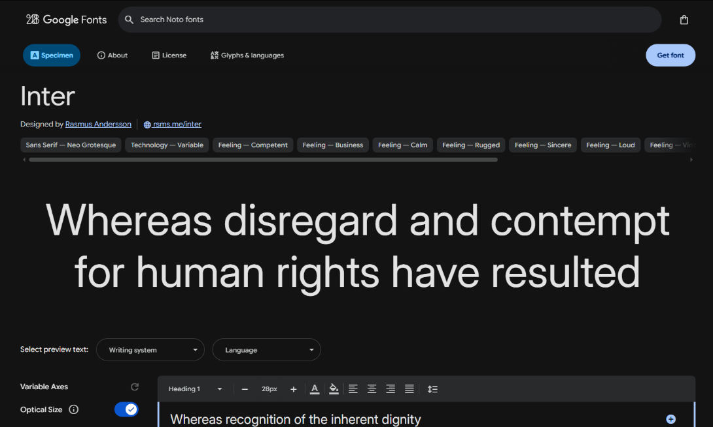
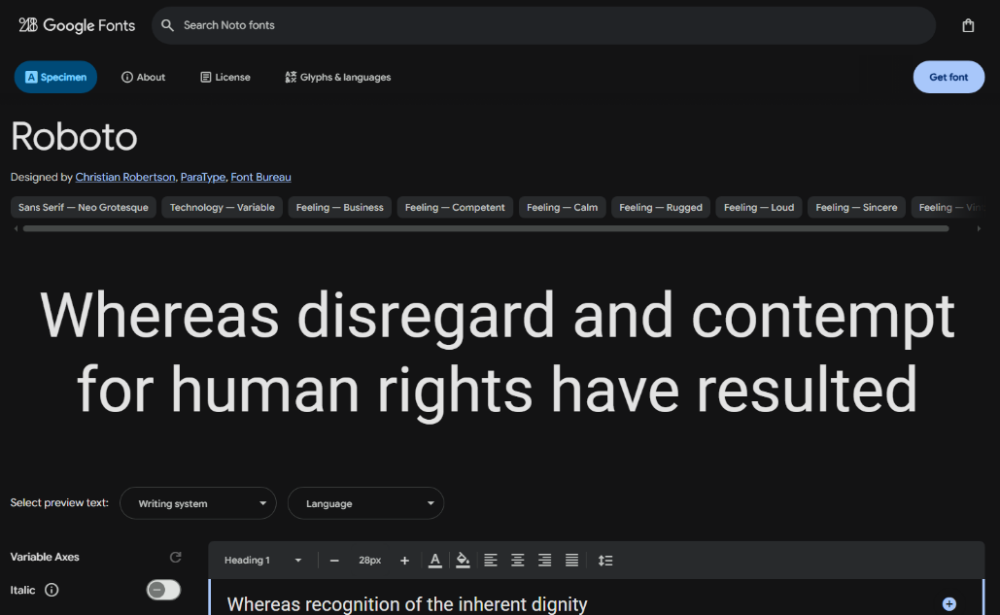

# PhishShield — Design Specification

> **Version:** 1.0  
> **Status:** Draft

---

## Table of Contents

1. [Brand Identity](#1-brand-identity)
2. [Logo Direction](#2-logo-direction)
3. [Colour System](#3-colour-system)
4. [Typography](#4-typography)
5. [Spacing System](#5-spacing-system)
6. [Border Radius](#6-border-radius)
7. [UI Components](#7-ui-components)
8. [Accessibility](#8-accessibility)
9. [Motion & Animation](#9-motion--animation)
10. [Dashboard Layout](#10-dashboard-layout)

---

## 1. Brand Identity

**Mission:** Help organisations build human resilience against phishing attacks.

**Product Personality:** Trustworthy; Intelligent; Protective; Motivating; Modern

**Tone of Voice:** Clear, Helpful, Encouraging, Professional.

> ✅ *"Well done! You identified a phishing attempt."*  
> ❌ *"You failed."*

---

## 2. Logo Direction

| Element | Detail |
|---|---|
| Primary concept | Shield + envelope + checkmark |
| Variants | Full logo with wordmark, icon-only, dark mode |

---

## 3. Colour System

Use semantic colour tokens throughout the codebase; hardcoded hex values should be avoided.

| Token | Value | Purpose |
|---|---|---|
| `primary-navy` | `#0F172A` | Trust / Headers / Navbars |
| `accent-blue` | `#2563EB` | Buttons / Links / Focus states |
| `success-green` | `#22C55E` | XP gains / Wins |
| `warning-amber` | `#F59E0B` | Suspicion indicators |
| `danger-red` | `#EF4444` | Threat / Danger / Failed detection |
| `surface-white` | `#FFFFFF` | Cards / Surfaces |
| `neutral-gray` | `#64748B` | Secondary text |

---

## 4. Typography

**Primary font:** [Inter](https://fonts.google.com/specimen/Inter)  
**Secondary font:** [Roboto](https://fonts.google.com/specimen/Roboto)

### Type Scale

| Role | Size | Weight | Usage |
|---|---|---|---|
| H1 | 32px | 700 | Page titles |
| H2 | 24px | 600 | Section headings |
| H3 | 20px | 600 | Sub-sections |
| Body | 16px | 400 | General content |
| Caption | 12px | 400 | Labels / metadata |

---

## 5. Spacing System

Base unit: **8px grid**

| Token | Value |
|---|---|
| `space-1` | 8px |
| `space-2` | 16px |
| `space-3` | 24px |
| `space-4` | 32px |
| `space-5` | 40px |
| `space-6` | 48px |

---

## 6. Border Radius

| Token | Value | Usage |
|---|---|---|
| `radius-sm` | 6px | Small elements (badges, tags) |
| `radius-md` | 10px | Buttons, inputs, cards |
| `radius-lg` | 16px | Modals, large panels |

---

## 7. UI Components

### Buttons

| Variant | Style | Usage |
|---|---|---|
| Primary | Blue filled (`accent-blue`) | Main CTA actions |
| Secondary | Outline (border only) | Secondary actions |
| Danger | Red filled (`danger-red`) | Destructive actions |
| Ghost | Text only, no background | Tertiary / inline |

**Required states:** `default`; `hover`; `active`; `disabled`; `loading`

---

### Other Components

| Component | Purpose |
|---|---|
| **Cards** | Dashboard metrics and data summaries |
| **Tables** | Campaign reports, user lists |
| **Toasts** | Success / failure feedback notifications |
| **Leaderboard** | Rank; Name; XP display |
| **Badges** | Achievement tiers: Bronze / Silver / Gold |

---

## 8. Accessibility

PhishShield targets **WCAG 2.1 Level AA** compliance.

| Requirement | Detail |
|---|---|
| Colour contrast | Minimum 4.5:1 for body text, 3:1 for large text; [click here for more](https://webaim.org/resources/contrastchecker/) |
| Keyboard navigation | All interactive elements reachable via keyboard |
| Focus states | Visible focus rings on all focusable elements |
| Typography | Readable fonts, no text smaller than 12px |
| Images | Alt text required on all meaningful images |

---

## 9. Motion & Animation

Keep animations **subtle and purposeful** (never decorative for its own sake).

| Transition | Duration | Usage |
|---|---|---|
| Hover | 150ms | Buttons, links, cards |
| Modal open/close | 250ms | Dialog overlays |
| Page transition | 400ms | Route changes |

**Special interactions:**
- XP gain popups (reward feedback)
- Toast fade-ins (system notifications)

---

## 10. Dashboard Layout

**Structure:** Sidebar navigation + Top navbar + Main content grid

> *Wireframes to be designed in Figma — see `figma/` for links and frames.*

---

*Last updated: 12/05/2026*
