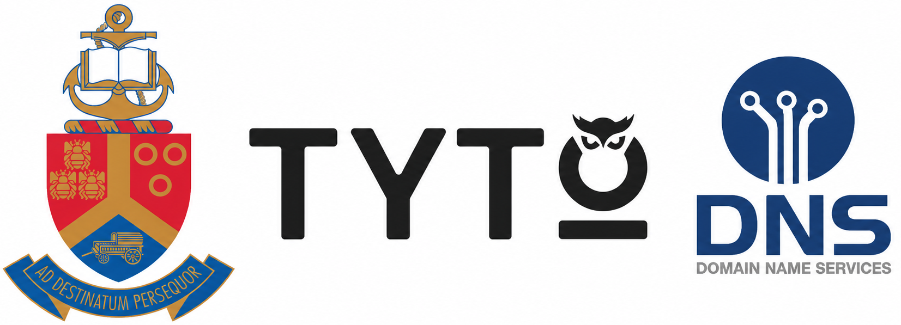

# Tyto PhishShield

### AI-Powered Phishing Awareness & Simulation Platform

Developed by **Team FIVE GUYS**

University of Pretoria • Tyto Insights • DNS Business

 

  
  
  

  
  
  

---

<h1 align="center">ℹ️Description</h1>
Tyto-PhishShield is an AI-powered phishing awareness and simulation platform. 
The platform gives employees the chance to encounter realistic phishing attacks in a controlled simulated environment. 
In this way the employees are trained to detect phishing attacks and prevent company information from being leaked.

To encourage continuous learning, the platform incorporates gamification through XP and leaderboards, motivating users to actively participate in training while building stronger phishing awareness over time.

<table>
<tr>
<th width="50%">🚨 The Problem</th>
<th width="50%">💡 The Solution</th>
</tr>

<tr>
<td>

Phishing remains one of the biggest cybersecurity threats facing organisations. Traditional awareness training is often infrequent, difficult to measure and does not always reflect real-world attacks.

</td>

<td>

Tyto PhishShield helps to make employees part of the firewall. It provides realistic phishing simulations, AI-assisted campaign generation and an integrated Outlook Add-in. The platform helps organisations continuously improve employee awareness through practical training and measurable results.

</td>
</tr>
</table>

 

---

<h1 align="center">Features</h1>

<table>
<tr>

<td width="50%" valign="top">

### AI Phishing Simulations

Generate realistic phishing emails with configurable difficulty levels to create engaging and effective awareness campaigns.

</td>

<td width="50%" valign="top">

### Reporting with Outlook Add-in

Report suspicious emails directly from Microsoft Outlook with a single click. Employees receive immediate feedback while administrators can review reporting activity.

</td>
</tr>

<tr>
<td width="50%" valign="top">

### Campaign Management

Create, schedule and manage phishing campaigns for different departments or user groups through an intuitive web portal.

</td>

<td width="50%" valign="top">

### Gamification

Keep employees engaged through XP, live leaderboards and learning experiences that encourage continuous improvement.

</td>
</tr>

<tr>
<td width="50%" valign="top">

### Analytics Dashboard

Monitor campaign performance, reporting behaviour and organisational awareness through real-time dashboards and metrics.

</td>

<td width="50%" valign="top">

### Secure Authentication

Role-based access control ensures that users, analysts and administrators have access to the tools and information appropriate to their role.

</td>
</tr>

<tr>
<td width="50%" valign="top">

### Teachable Moments

Employees receive immediate explanations and guidance after interacting with simulated phishing emails, helping reinforce good security habits.

</td>

<td width="50%" valign="top">

### Microservice Architecture

Built using a scalable microservice architecture with Docker support, making the platform easy to deploy, maintain and extend.

</td>
</tr>
</table>

 

---

<h1 align="center">Get Started</h1>

Follow our setup guide

[Setup Instructions](docs/setup-instructions/README.md)

 

---

<h1 align="center">📚 Documentation</h1>

All project documentation can be found in our
[Documentation Hub](docs/README.md).

### Important / Frequently Used Documents

| Document |
|-----------|
| 📋 [Software Requirements Specification (SRS)](docs/SRS/Software_Requirements_Specification.md) |
| 📖 [Project Documentation](project/README.md) |
| 🚀 [Scrum Documentation](https://github.com/COS301-SE-2026/Tyto-PhishShield/wiki/Scrum) |
| 🎨 [Design Specification Preview](docs/design-specifications/design-specifications-document.md) |
| 🎨 [Design Specification Document](docs/design-specifications/design-specifications-document.md) |

 

---

<h1 align="center">📅 Project Board</h1>

Track our current development progress and issues on our GitHub Project Board.

➡️ **[Open the Project Board](https://github.com/orgs/COS301-SE-2026/projects/43)**

 

---

 

<h1 align="center">👥 Meet Team FIVE GUYS</h1>

<table>
<tr>

<td align="center" width="20%">

### Josua Louw

**Team Lead & Integration Engineer**

 

</td>

<td align="center" width="20%">

### Daniel Darius Erasmus

**Backend Engineer**

 

</td>

<td align="center" width="20%">

### Heindrich Jansen

**Backend Engineer**

 

</td>

</tr>

<tr>

<td align="center" width="20%">

### Nico Theron

**Frontend Engineer & Outlook Add-in**

 

</td>

<td align="center" width="20%">

### Frikkie Malan

**Frontend Engineer & UI/UX**

 

</td>

<td>

</td>

</tr>

</table>

