# Software Architecture Specification

## Introduction
The Software Architecture Specification (SAS) document creates a formal guide to satisfy the Software Requirments Specification (SRS) document. 

- The architectural requirments section covers the high-level structure of the system.
- The Technology requirements section outlines the technologies used to implement the system.
- The api-service contracts defines the contracts used to communicate between frontend and backend systems.
- The deployment section covers how the system is deployed.

## Architectural Requirements

### Architecture Patterns
The Tyto-PhishShield system consists of three parts namely: The client side, the microservices and the event system. 
#### Client-Server
The first level of the architecture is that we use a Client-Server architecture where the clients will communicate to the servers through the API gateway. On the client side, clients will use a request response model to communicate with the API gateway. Everything after the API gateway will form the server side of the architecture. 

Responsibilbity: 
API gateway is responsible for receiving client requests, authenticating clients and doing roll-based authentication control. The API gateway then routes user traffic to the correct microservice to handle user business logic.
#### Microservices
Microservices is used to handle each business goal of the system. The API gateway handles routing and dividing of user requests to the correct service in order to isolate business logic and create a modular and scalable platform. The API gateway will use a request response model for communicating with the Microservices. Each Microservice has its own database and handles its own methodes for communicating with the api-gateway and over the event queues.

Responsibilbity: 
Each microservice is self contained and receives requests from the API gateway. The microservice will handle business logic based on its definition and will also handle it's own transactions with its own database. A microservice may also send an event with data attached (a message) to the event system if other business logic needs to be accomplished but is not within the scope of the microservice.
#### Event Driven Pattern
An Event Driven pattern is used in the event system to handle communication between services. Some services are publishers while others are subscribers, some may be both as well. In this way services can be kept independent of one another and eventually still be consistent with one another.

Responsiblity: 
The event system contains multiple event queues in which an event being processed by the system can attach messages to a given queue and send out the messages to the correct microservice which is subscribed to a specific queue. 

Thus in using these architectural patterns the system essentially uses Event Driven Microservices as its official architectural pattern.

### Architecture Diagram

### Design Patterns
Analyzing the system on a design level we can point out the usage of a few design patterns: 
#### Facade
Firstly the API gateway acts as a facade, creating an interface through which the rest of the system can be used. This improves maintainability since we make use of one entry point through which requests enter into the system which is easier to maintain than having multiple entry points. 

#### Mediator
The Event Driven System acts as a mediator for the services. The Event Driven System can have multiple event exchanges through which services can receive and send different types of event messages and handle some system logic on the backend. This improves flexibility allowing system logic to be handled independently by separate services.

#### Publish Subscribe
Microservices each handle their own methods of communication. The only dependency is to know on which express queue they can recieve their data that they may be interested in. In this way the Microservices form a publish subscribe pattern where some services are subscribers and others are publishers and some are both just on different express queues.

### Constraints 
 1. The system must run on a single server.
 2. Any technologies used should be free and open source.
 3. POPIA & GDPR compliance required.
 4. Build native Outlook Add-in (Office JS API).
 5. API authenticates all enpoints before anything reaches the services.
 6. Each Microservice's database is its own and may not be accessed by another.
 7. The CI/CD pipeline shall automatically execute unit and integration tests on every push to the main development branches through GitHub Actions.

### Quality Requirements based off of [NFR](./Software_Requirements_Specification.md#non-functional-requirements)

#### NFR 1 Quality attribute: Security
1. The system must reject 100% or requests to protected API endpoints that have invalid or expired authentication tokens.
2. The system must enforce that 100% of the protected API endpoints can only be accessed by users with an appropriate role.

**Tactic:** Use RBAC in the API gateway, use authorization tokens.

**Pattern:** Centralized API gateway authentication pattern.

**ADR-01** Users authenticated for protect endpoints 
|**Context**|**Decision**|**Consquences**|
|---|---|---|
| Only authenticated users should be able to have access to the system.| Use Auth0 for all authorization requests. | No authentication is done in individual microservices, it is only done in the API gateway. Thus all requests have to go to the API gateway first and it should not be possible to send a request directly to a microservice. |

**ADR-02** RBAC for protect endpoints 
|**Context**|**Decision**|**Consquences**|
|---|---|---|
| Users have specific roles and should only have access to what their role is meant to have access to. | Apply RBAC at the API gateway with Auth0. Use Auth0 for all authorization requests. | No RBAC is applied in individual microservices, it is only applied in the API gateway. Thus all requests have to go to the API gateway first and it should not be possible to send a request directly to a microservice. |

**NRF Test:** 
- Test that only HTTPS requests work. 
- Test that unauthorized user roles do not have access to protected API endpoints.
- Test that users with invalid authentication tokens do not have access to protected API endpoints.

**HTTPS Request**
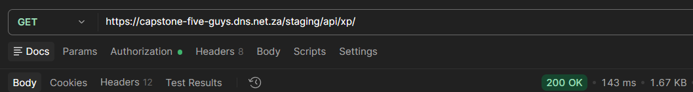
This image shows a valid request using HTTPS that returns successful.

**HTTP Request**
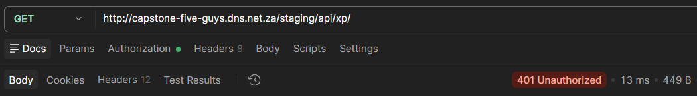
This image shows a unsuccessful request since HTTP was used instead of HTTPS.

**Requests to protected API endpoints without a valid authentication token and without the role necessary to access those endpoints**
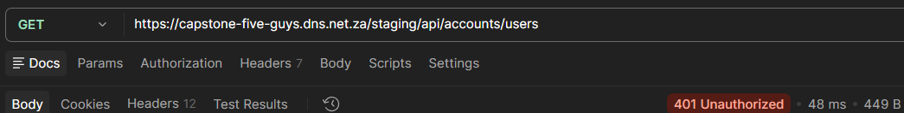
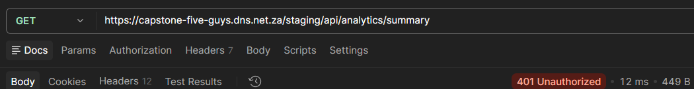
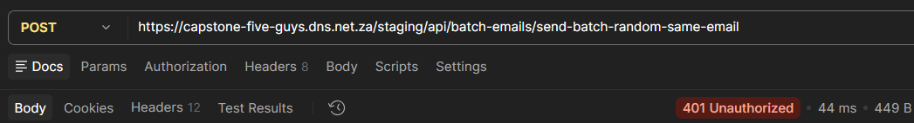
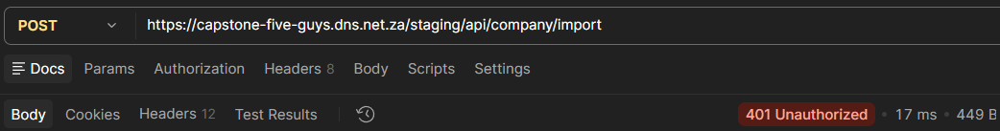
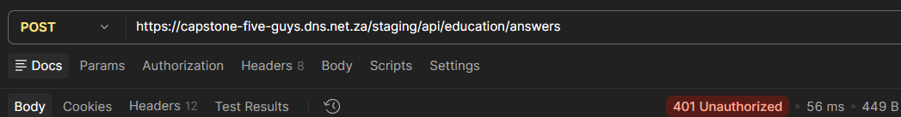
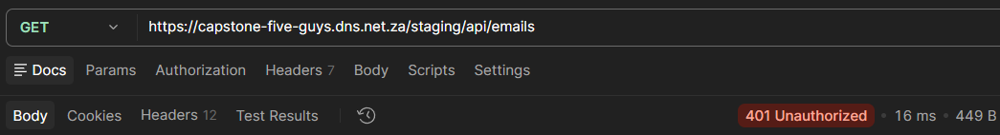
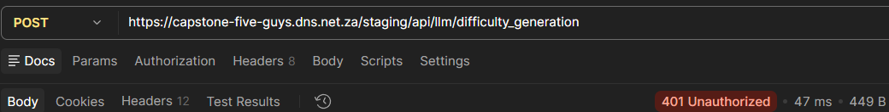
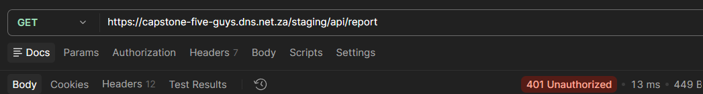
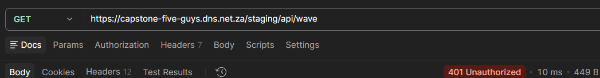
The above images shows unsuccessful requests because the user does not have the valid authentication token of an admin or analyst who have the necessary role clearance.

#### NFR 2 Quality attribute: Performance
1. The system shall handle XP transactions and leader board updates within 1s of user action.
2. The admin dashboard shall update live analytics and leaderboard data within **3 seconds** of receiving new event data through WebSocket communication.
3. The system must maintain a server error rate of less than 0.1% when subjected to a load up to 500 concurrent users.
4. The system must maintain a 95th percentile response time of under 2 seconds for all API requests when subjected to a load up to 500 concurrent users.

**Tactic:** Spread the load accross 2 API gateway instances, make use of caching for non-live reads, optimize database indexing.

**Pattern:** Add a load balancer to balance requests between two API gateways. 

**ADR-03** Load balancer for API gateway traffic
|**Context**|**Decision**|**Consquences**|
|---|---|---|
| Many requests for different services need to pass through the API gateway. Response time needs to be optimal according the the measures in the quality attribute. | Add a second API gateway instance and use a load balancer to spread the load. | Increases the complexity of the system and adds a bit of latancy. |

**NRF Test:** 
- Test system responsiveness with 500 concurrent users and that it remains under 2s.
- Test that error rate is less than 0.1% when subjected to a load of 500 concurrent users.
- Test that the response time is within 1s.

**500 Concurrent Users**
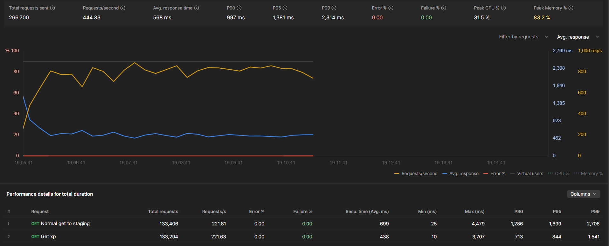
In this image you can see a test ran using 500 virtual users sending 266700 requests over a time period of 10min to the staging server. Two GET requests where sent namely, /xp and the loading of the landing page, since they are the most used endpoints for normal users. 0% Errors and 0% Failures where achieved with a 95th percentile response time of 1,381 second. This tests both point 3 and 4 of NFR 2.

**Response Time**
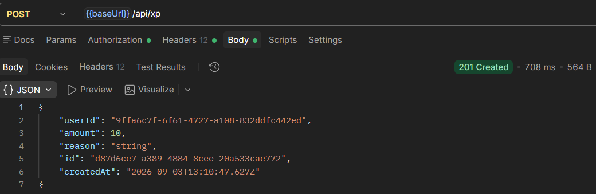
It takes less than one second for the xp change to happen.

#### NFR 3 Quality attribute: Portability and Compatibility
1. The system shall deploy the complete system from the Docker/Docker Compose configuration on the target Ubuntu environment without modifying application source code.

**Tactic:** Use Infrastructure as Code (IaC) and containerisation, use multiplatform design for frontend systems.

**Pattern:** Use docker and docker compose, use tailwind css to handle resolution scaling.

**ADR-04** Containerise all services
|**Context**|**Decision**|**Consquences**|
|---|---|---|
| System should be deployable on any ubuntu server environment. | Create a docker container for each service in the system | Running many containers on a server may use up server resources but limits can be added to ensure the system runs efficiently. |

**NRF Test:** 
- System is deployable.

**Behold**  
[our Website](https://capstone-five-guys.dns.net.za/)

#### NFR 4 Quality attribute: Usability  
1. The system shall comply with **WCAG 2.1 AA accessibility** guidelines for all user-facing dashboards and interfaces.

**Tactic:** Apply accessible interface design principles, including sufficient colour contrast, semantic HTML, accessible labels, keyboard navigation and visible focus states.

**Pattern:** Reusable accessible UI components and a consistent design system are used across the frontend to enforce accessibility requirements consistently.

**NRF Test:** 
- WCAG 2.1 AA accessibility compliance
- Test foreground and background colour contrast.
- Run Lighthouse accessibility tests on all major user-facing pages.

**ADR-05** Accessible frontend design

| **Context** | **Decision** | **Consequences** |
|---|---|---|
| All user-facing interfaces must comply with WCAG 2.1 AA accessibility requirements. | Use reusable accessible UI components and globally defined styles to maintain WCAG 2.1 AA accessibility across the frontend. | Accessibility requirements can be applied consistently across the system, but frontend components and styling must be designed and tested with accessibility in mind. |

**Lighthouse results**
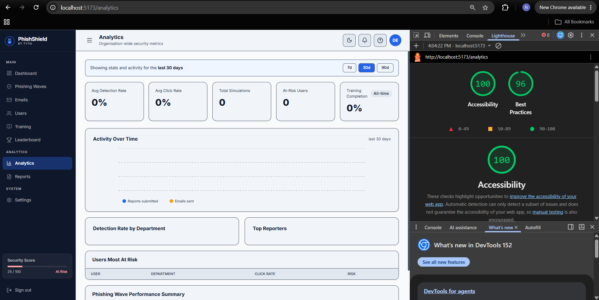
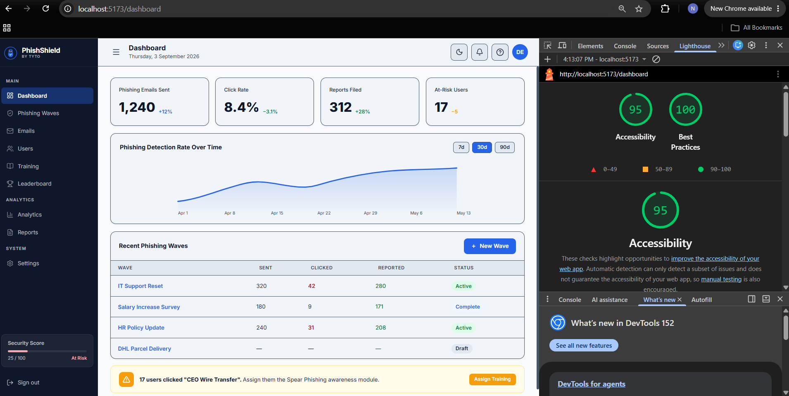
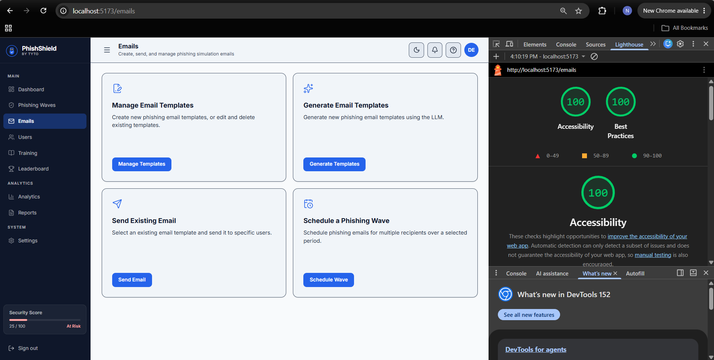
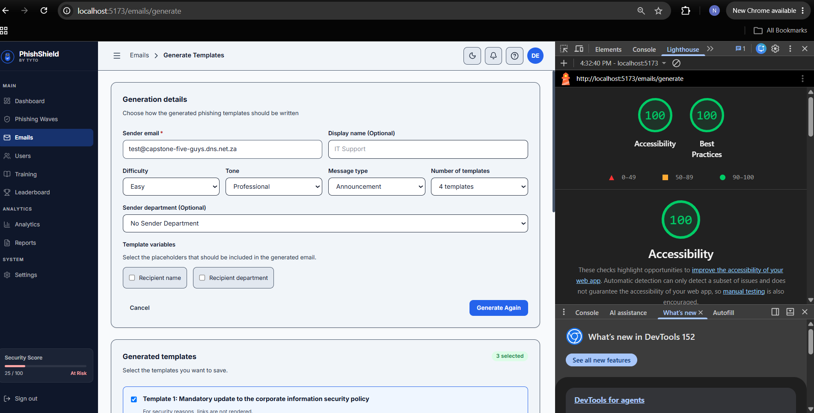
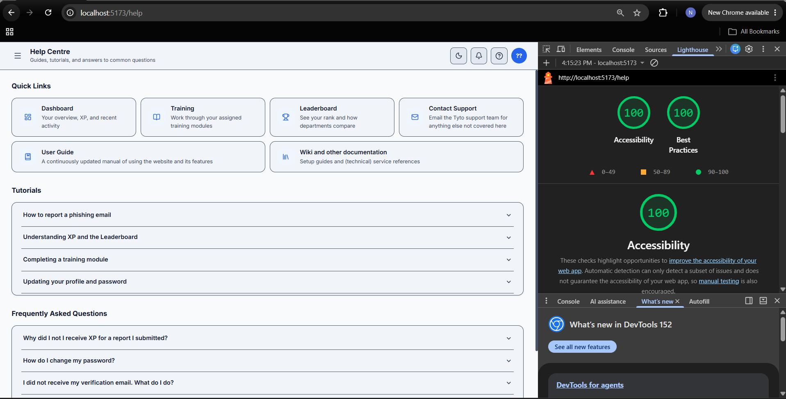
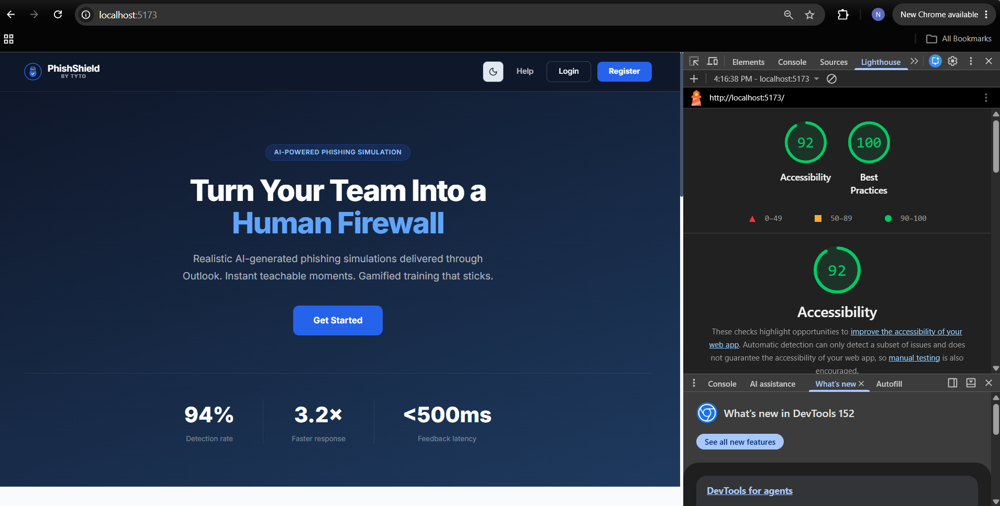
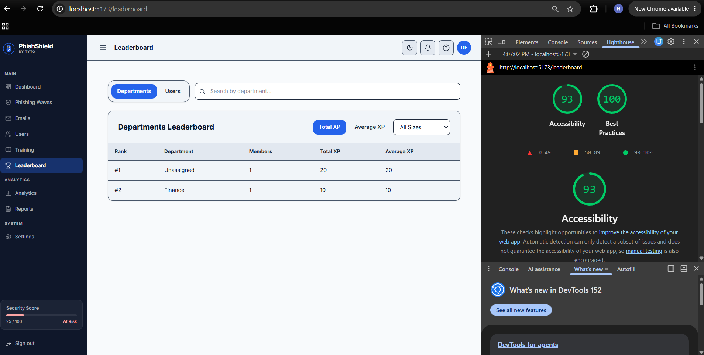
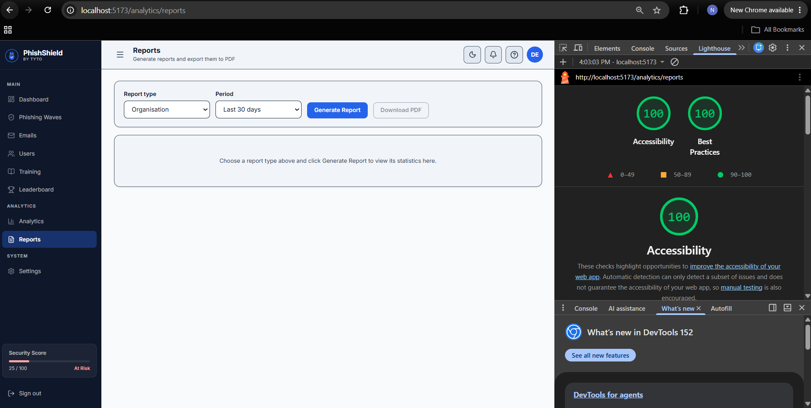
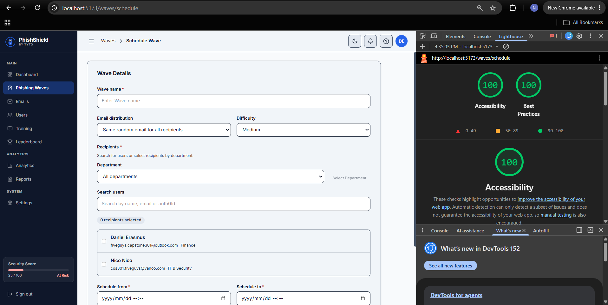
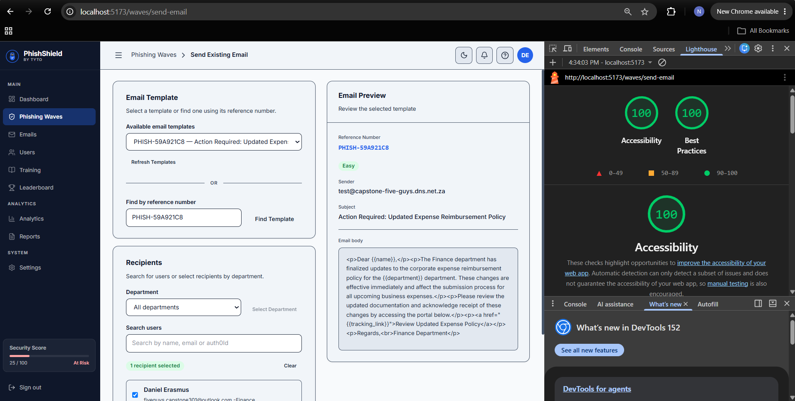
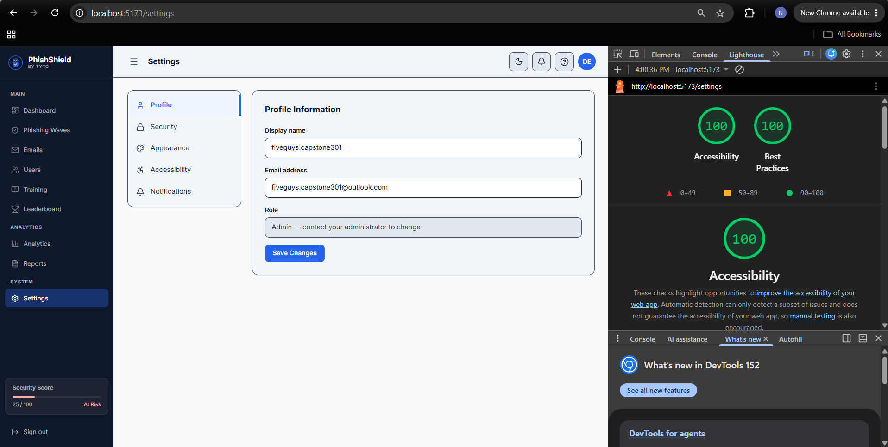
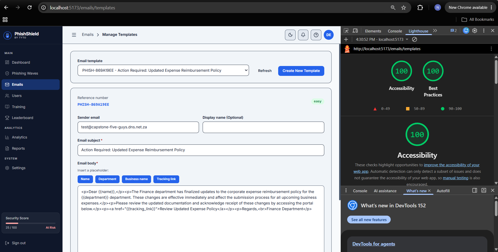
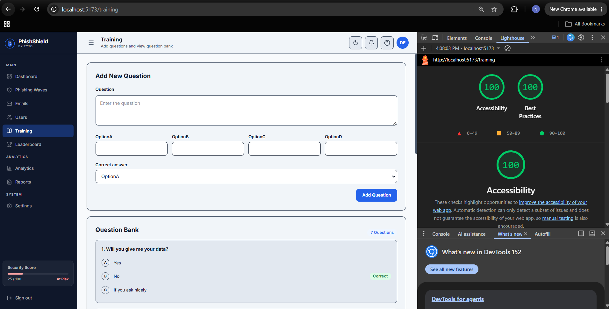
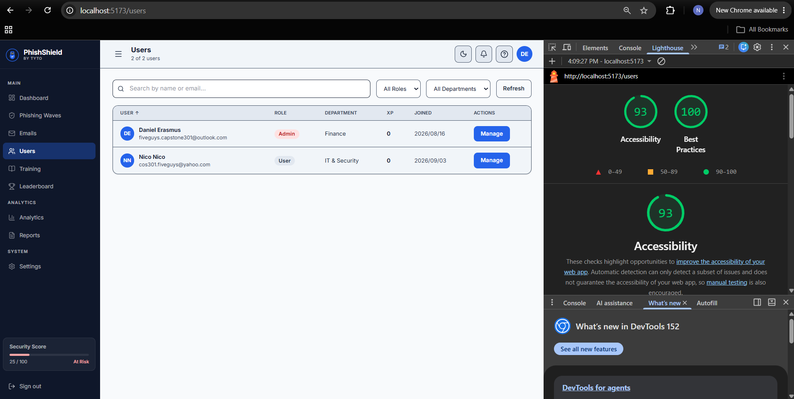
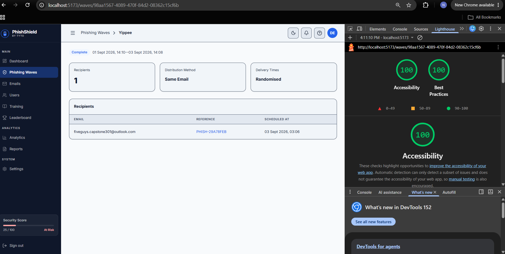
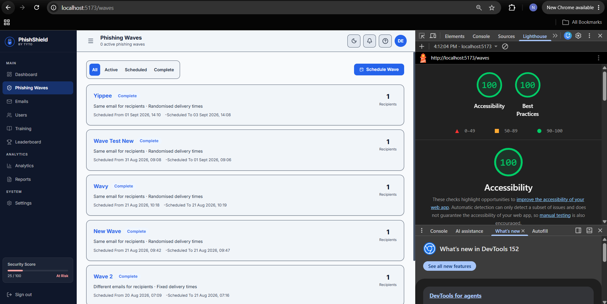
In the images above you can see the lighthouse accessibility and best practices results

#### NFR 5 Quality attribute: Reliability and Availability
1. The system must have 99.9% uptime.

**Tactic:** Remove single points of failure, log requests, error exception communication.

**Pattern:** Load balancing, log at load balancer.

**ADR-06:** *For load balancing see ADR-03.

**NRF Test:** 
- Uptime checks should yield >99.9% uptime.

**Uptime**  
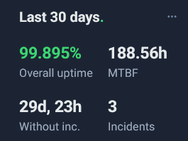  
As of demo 3 we have a 99.895% over the last 30 days. Although it is slightly less than 99.9% the difference is minuscule and it is a top priority for us going forward to fix this and ensure a 99.9% uptime. Our new tactic with the green blue deployment method will hopefully allow us to achieve the 99.9% uptime.

#### NFR 6 Quality attribute: Flexibility:
1. The system must be able to scale up to 500 concurrent users without any of the core services becoming unresponsive. 

**Tactic:** Spread the load accross multiple independent services.

**Pattern:** Microservices

**ADR-07** Microservices
|**Context**|**Decision**|**Consquences**|
|---|---|---|
| System must be able to scale well and handle 500 concurrent users. | Use microservices to spread requests between many independent services. | Introduces increased complexity to the system. |

**NRF Test:** 
- Test system with 500 concurrent users and check to see if any core services becoming unresponsive.

**500 Concurrent Users**

No core services became unresponsive with 500 concurrent users.

#### NFR 7 Quality attribute: Maintainability
1. The system shall achieve a minimum automated backend test coverage of 80%.

**NRF Test:** 
- Code coverage of 80% is reached.

**Test Coverage**
As of demo 3 we have an average backend coverage of 73.77%. This is below our NFR requirement of 80%.

### NFR Quality Requirement Matrix

| ID | NFR | Quantified requirement | Tactic in SAS | Test / tool | Target / actual |
|---|---|---|---|---|---|
| QR-01 | NFR 1 - Security | Protected API requests with invalid or expired authentication tokens must be rejected | RBAC at API gateway + authorization tokens | Postman / Protected endpoint authentication tests | 100% rejected / Pass for tested endpoints |
| QR-02 | NFR 1 - Security | Protected API endpoints may only be accessed by users with an appropriate role | Centralized RBAC at API gateway | Postman / Protected endpoint role authorization tests | 100% enforced / Pass for tested endpoints |
| QR-03 | NFR 2 - Performance | XP transactions and leaderboard updates must complete within 1 second of user action | Load distribution, caching and database indexing | Postman / XP transaction response-time test | <1 s / <1 s |
| QR-04 | NFR 2 - Performance | Live analytics and leaderboard data must update within 3 seconds of receiving new event data | WebSocket communication | WebSocket update latency test | <3 s |
| QR-05 | NFR 2 - Performance | Server error rate must remain below 0.1% at 500 concurrent users | Load balancing across API gateway instances | Postman | <0.1% / 0% |
| QR-06 | NFR 2 - Performance | 95th percentile API response time must remain below 2 seconds at 500 concurrent users | Load balancing, caching and database indexing | Postman | <2 s / 1.381 s |
| QR-07 | NFR 3 - Portability and Compatibility | Platform must be deployable without platform-specific application modifications | Infrastructure as Code + containerisation | Docker / Docker Compose deployment test | No platform-specific modifications / Pass on target deployment environment |
| QR-08 | NFR 4 - Usability | All user-facing dashboards and interfaces must comply with WCAG 2.1 AA accessibility requirements | Accessible interface design, semantic HTML, sufficient colour contrast, accessible labels, keyboard navigation and visible focus states | Lighthouse | WCAG 2.1 AA |
| QR-09 | NFR 5 - Reliability and Availability | System uptime must be at least 99.9% | Load balancing, removal of single points of failure and health monitoring | UptimeRobot | >=99.9% / 99.895% |
| QR-10 | NFR 6 - Flexibility | System must support 500 concurrent users without core services becoming unresponsive | Independent microservices + load distribution | Postman / 500 concurrent user load test | 500 users with no unresponsive core services / Pass |
| QR-11 | NFR 7 - Maintainability | Automated backend test coverage must be at least 80% | Automated test coverage measurement | Test coverage report / GitHub Actions | >=80% / 73.77% |

 <!-- 1. Flexibility: See [NFR 6](./Software_Requirements_Specification.md#non-functional-requirements)

	Adaptable: 
	The system should be adaptable so that through out the development of the platform new subsystems can easily be added and updated by swapping out a certain microservice. This can be measured by checking: 
	- high code modularity
	- loose coupling between services
	- ensuring the code is self documented and readable

	Scalable: 
	The system must be horizontally scalable to handle a minimum of 500 concurrent users. This can be measured by checking: 
	- concurrent connection requests
	- testing increasing connection requests

	Architectural Decision: 
	- Use microservices to suport adaptable  development.
	- Use a load balancer to balance requests between multiple instances of the api-gateway. -->

 <!-- 2. Maintainability: See [NFR 7](./Software_Requirements_Specification.md#non-functional-requirements)

	It is important for the system to be maintainable so that through out the development process and during handover it will be possible for anyone to maintain the life time of the system. It is also important that business operation are not disrupted during the life time of the platform. -->

 <!-- 3. Performance Efficiency: See [NFR 2](./Software_Requirements_Specification.md#non-functional-requirements)

	Performance of the system is important to maintain the live updates of statistics. This can be measured by checking:
	- the number of requests handled per second
	- the average response time for requests

	Quantification:
	- requests all take less than 1s
	- handle 500 requests per second

	Architectural Descision:
	- 
	- 
	- Asyncronise backround processing -->

 <!-- 4. Reliability: See See [NFR 5](./Software_Requirements_Specification.md#non-functional-requirements)
	
	The system should be reliable and maintain a high uptime. In any event of a failure with an LLM the system should fallback to another model.

	Quantification:
	- ensuring a 99.9% uptime
	- making sure the system can quickly recover from any failures within 30s

	Architectural descision:
	- Make use of a load balancer and spin up multiple instances of the api-gateway. Balance requests between the instances.
	- Add restart mechanisms to all services. -->

 <!-- 6. Auditability:

	The system should be auditable to comply with POPIA and GDPR laws. It also allows any faults to be found and understood. This can be checked by:
	- error logs, application logs, access logs
	- adding granular logging abilities to traceback activity

 7. Functional suitability: 

	The system must be functionally suitable, meaning the system must be tested for logical errors. All functions and operations must be tested with unit and integration tests. Code coverage should be above 80%. This can be measured by checking:
	- automation of unit tests on GitHub actions
	- the build status of the system
	- the code testing coverage  -->

 <!-- 8. Interaction capability: See [NFR 4](./Software_Requirements_Specification.md#non-functional-requirements)

	The system must be usable and easy to interact with. Employees should not need to be trained on how to use the system. The system must be intuitive providing good user experience. This can be measured by checking:
	- development of wireframes
	- performance of UI tests

	Quantification:
	-  -->

<!-- 9. Compatibility See [NFR 3](./Software_Requirements_Specification.md#non-functional-requirements)

	The compatibility of the system is very important so that future integration with HR systems can take place. Using microservices enables the system to be integrated easily due to the separation of concerns. 
	Quantification:
	- Deployed on a single server using docker
	- Compatible on screen resolutions from 1280px to 1920px+ -->

## Technology Requirements

### React + Tailwind CSS
Making use of react and tailwind CSS with proper UI design from our frontend developers we can comply with the WCAG 2.1 AA accessibility.

### NestJS
Using NestJS we can build a proper api-gateway, and microservices which will be able to scale well and perform well, thus meeting the requirements for flexibility and performance.

### PostgreSQL
Using PostegreSQL helps keep data persistent for our services and also performs well satisfying our performance requirements.

### Jest, Vitest and Supertest
Using these testing packages we can build tests to ensure our system is functionally suitable.

### Socket.IO, RabbitMQ
These technologies help drive the event driven aspect of our system maintaining live updates for the frontend as well as allowing background processing to take place between requests.

### Caddy
Caddy helps reverse proxy requests coming to our server to the correct endpoints (frontend website or addin and backend api-gateway). Caddy can also be used as a load balancer.

### Docker
Docker containerizes the system in separate containers making our system portable and compatible.

## API Service Contracts

[View documentation](./service-contracts/api-service-contract.md)
[View open-api yaml file](./service-contracts/openapi.yaml)

## Deployment

### Deployment Requirements
[View the Live System](https://capstone-five-guys.dns.net.za/)

Currently we have a local development environment that we run on our local computers for testing the integrated system. Then we deploy the system automatically to docker hub and we use watchtower to pull new images into our staging development environment.

Once everything is working in the staging environment we can prepare the compose files for production. We apply the hashed tags to the new blue or green compose file. Then we run `pnpm deploy:production` to start the deployment process for the new services. [See process below.](#deployment-process)

Containerization: All services are containerized and are able to run in a docker environment. This allows the local integration testing and production environments to be reproducible through the containers.

Environment variables are used on the server to set up our staging development environment, prodcution environment, and GitHub secrets are used to deploy our containers to docker hub.

Roll-back strategy: We use blue green roll-back to provide 0 down time for the services. [(See deployment process below)](#deployment-process) 
For the production infrastructure we do update the infrastructure compose file and then start any new services added to the infrastructure while causing minimal down time. 

### Deployment Process
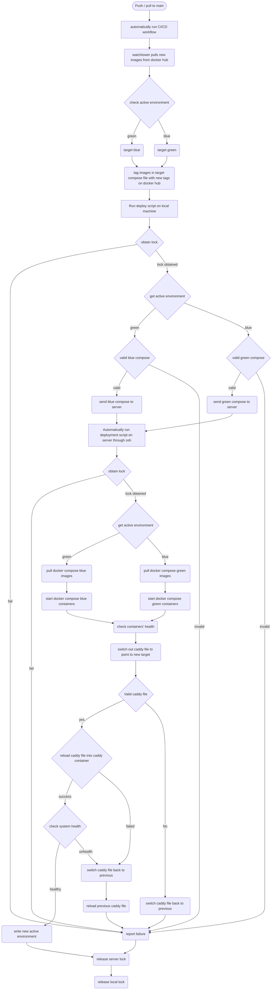
```mermaid
flowchart TD
	A([Push / pull to main]) --> B[automatically run CI/CD workflow]
	B --> C(watchtower pulls new images from docker hub)
	C --> D{check active environment}
	D --> |green| E(target blue)
	D --> |blue| F(target green)
	E --> G(tag images in target compose file with new tags on docker hub)
	F --> G
	G --> H[Run deploy script on local machine]
	H --> I{obtain lock}
	I --> |fail| Z
	I --> |lock obtained| J{get active environment}
	J --> |green| K{valid blue compose}
	J --> |blue| L{valid green compose}
	K --> |valid| M(send blue compose to server)
	K --> |invalid| Z
	L --> |valid| N(send green compose to server)
	L --> |invalid| Z
	M --> O[Automatically run deployment script on server through ssh]
	N --> O
	O --> P{obtain lock}
	P --> |fail| Z
	P --> |lock obtained| Q{get active environment}
	Q --> |green| R(pull docker compose blue images)
	Q --> |blue| S(pull docker compose green images)
	R --> T(start docker compose blue containers)
	S --> U(start docker compose green containers)
	U --> V(check containers' health)
	T --> V
	V --> W(switch out caddy file to point to new target)
	W --> X{Valid caddy file}
	X --> |yes| Y{reload caddy file into caddy container}
	X --> |No| a(switch caddy file back to previous)
	a --> Z
	Y --> |success| b{check system health}
	Y --> |failed| c(switch caddy file back to previous)
	c --> d(reload previous caddy file)
	d --> Z
	b --> |healthy| e(write new active environment)
	b --> |unhealth| c
	e --> f(release server lock)
	f --> g(release local lock)
	Z(report failure) --> f
```

### Deployment Diagram

### CI/CD Pipeline
#### Backend workflow
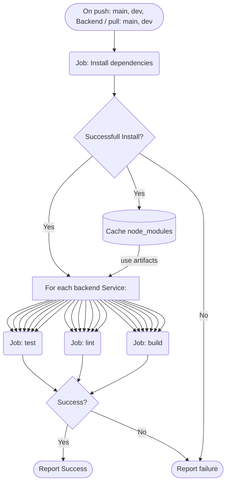
```mermaid
flowchart TD
    A([On push: main, dev, Backend / pull: main, dev]) --> B(Job: Install dependencies)
    B -->C{Successfull Install?}
	C --> |Yes| K[(Cache node_modules)]
	K --> |use artifacts| D
    C -->|Yes| D[For each backend Service:]
    C -->|No| E([Report failure])
    D --> F(Job: build)
    D --> G(Job: lint)
    D --> H(Job: test)
	D --> F
	D --> G
	D --> H
	D --> F
	D --> G
	D --> H
	D --> F
	D --> G
	D --> H
	D --> F
	D --> G
	D --> H
	D --> F
	D --> G
	D --> H
	D --> F
	D --> G
	D --> H
    F --> I{Success?}
    G --> I
    H --> I
    I --> |Yes| J([Report Success])
    I --> |No| E
```

#### Frontend workflow

```mermaid
flowchart TD
    A([On push: main, dev, Frontend / pull: main, dev]) --> B(Job: Install dependencies)
    B -->C{Successfull Install?}
    C -->|Yes| D[For each frontend Service:]
	C --> |Yes| K[(Cache node_modules)]
	K --> |use artifacts| D
    C -->|No| E([Report failure])
    D --> F(Job: build)
    D --> G(Job: lint)
    D --> H(Job: test)
	D --> F
	D --> G
	D --> H
	D --> F
	D --> G
	D --> H
	D --> F
	D --> G
	D --> H
	D --> F
	D --> G
	D --> H
	D --> F
	D --> G
	D --> H
    F --> I{Success?}
    G --> I
    H --> I
    I --> |Yes| J([Report Success])
    I --> |No| E
```

#### Integration workflow
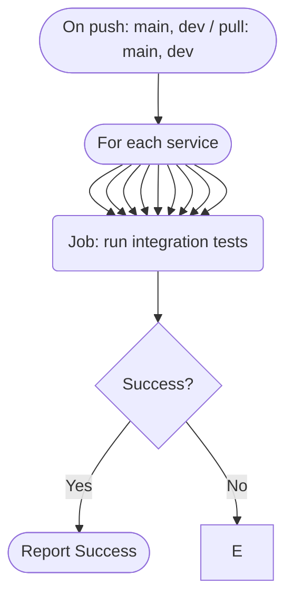
```mermaid
flowchart TD
    A([On push: main, dev / pull: main, dev]) --> D([For each service])
    D --> F(Job: run integration tests)
	D --> F
	D --> F
	D --> F
	D --> F
	D --> F
	D --> F
	D --> F
	D --> F
    F --> I{Success?}
    I --> |Yes| J([Report Success])
    I --> |No| E
```

#### CI workflow
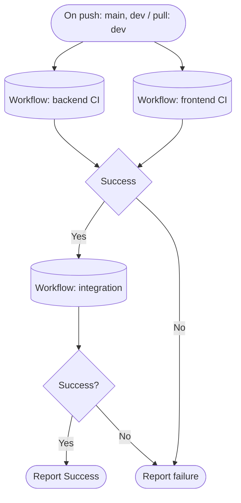
```mermaid
flowchart TD
    A([On push: main, dev / pull: dev]) --> B[(Workflow: backend CI)]
    A --> C[(Workflow: frontend CI)]
    C --> D
    B --> D{Success}
    D --> |Yes| E[(Workflow: integration)]
    D --> |No| H([Report failure])
    E --> F{Success?}
    F --> |Yes| G([Report Success])
    F --> |No| H
```

#### Deploy workflow
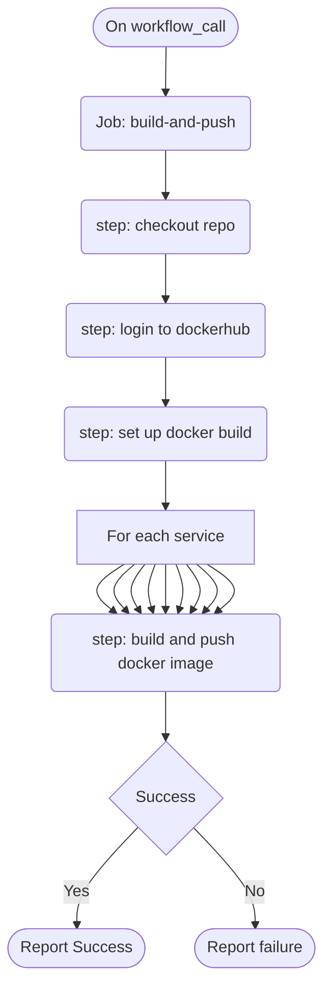
```mermaid
flowchart TD
    A([On workflow_call]) --> B(Job: build-and-push)
    B --> D(step: checkout repo)
    D --> E(step: login to dockerhub)
    E --> F(step: set up docker build)
	F --> G[For each service]
	G --> H(step: build and push docker image)
	G --> H
	G --> H
	G --> H
	G --> H
	G --> H
	G --> H
	G --> H
	G --> H
    H --> I{Success}
	I --> |Yes| J([Report Success])
	I --> |No| K([Report failure])
```

#### CI/CD workflow
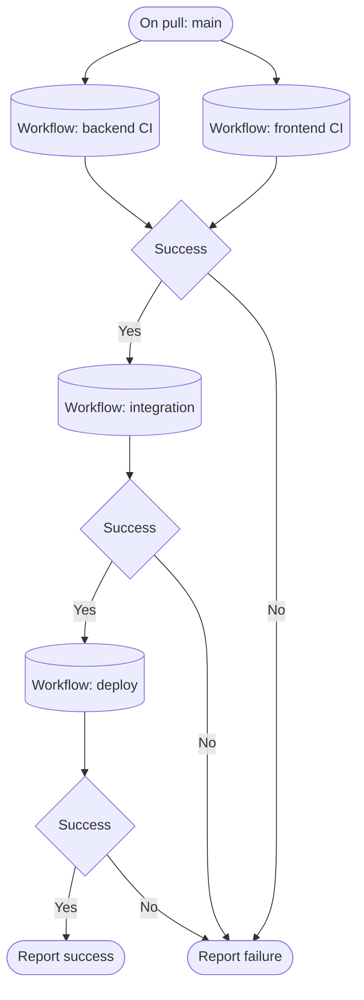
```mermaid
flowchart TD
    A([On pull: main]) --> B[(Workflow: backend CI)]
    A --> C[(Workflow: frontend CI)]
    C --> D
    B --> D{Success}
    D --> |Yes| E[(Workflow: integration)]
    D --> |No| H([Report failure])
    E --> F{Success}
    F --> |Yes| G[(Workflow: deploy)]
	G --> I{Success}
	I --> |Yes| J([Report success])
	I --> |No| H
    F --> |No| H
```
