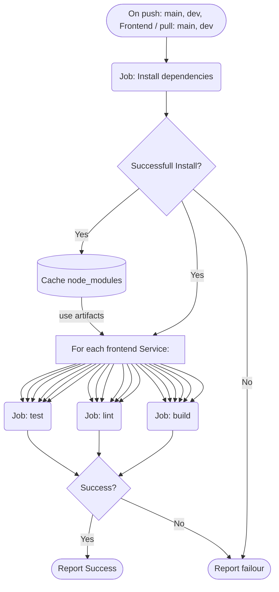
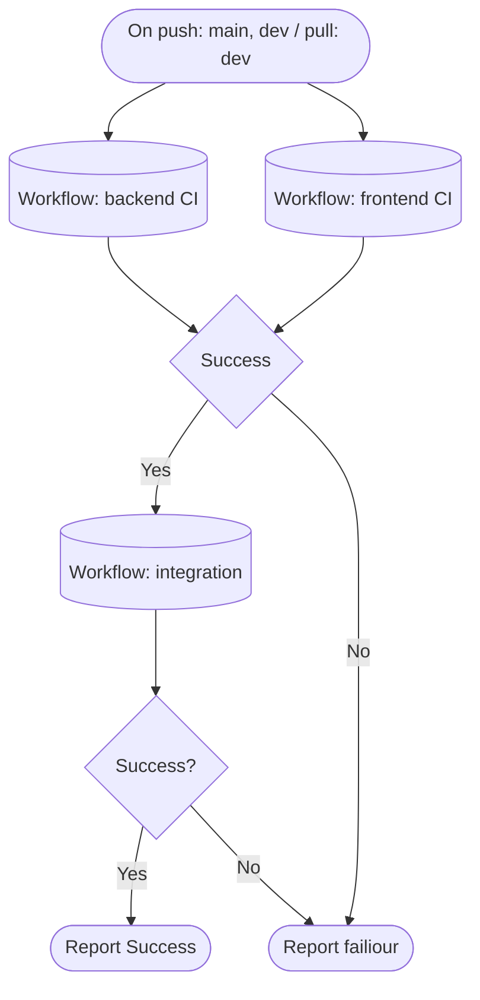
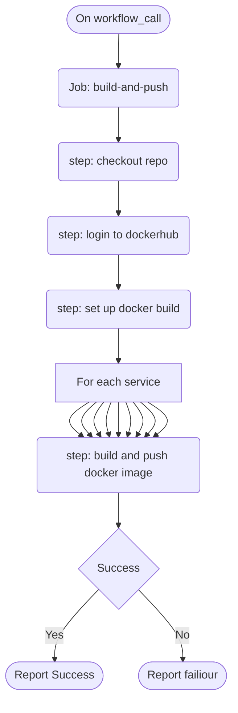
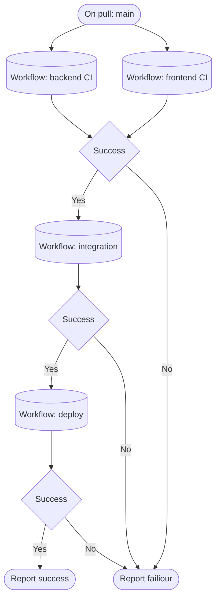

# Software Architecture Specification

## Introducation
The system consists of three parts namely: The client side, the microservices and the event system. 
The first level of the architecture is that we use a Client-Server architecture where the clients will communicate to the servers through the API gateway. Everything after the API gateway will form the server side of the architecture. 
Going in deeper on the server side, to handle communication between microservices we use event driven messaging by using the event system. On the client side, clients will use a request response model to communicate with the API gateway. The API gateway will also use request response communication with the micrservices. The primary communication protocol that will be used accross the system will be HTTP. We may use Remote Procedure Calls (RPC) if it is seen that some services require a response back from the event system. 

## Architecture Diagram

## Architectural Requirements

### Architecture Patterns
As already alluded to, there are two main architecture patterns being used. Microservices is used to handle each bussiness goal of the system. The API gateway handles routing and dividing of user requests to the correct service in order to isolate bussiness logic and create a modular and scalable platform. An Event Driven pattern is used in the event system to handle communication between services. Some services are publishers while others are subscribers, some may be both as well. In this way services can be kept independent of one another and eventually still be consistant with one another. 
Thus in using these two architectural patterns the system essentially uses event driven microservices as its official architectural pattern.

### Design Patterns
Analyising the system on a design level we can point out the usage of a few design patterns: 
Firstly the API gateway acts as a facade, creating an interface through which the rest of the system can be used. This improves maintainablity since we make use of one entry point through which requests enter into the system which is easier to maintain than having multiple entry points. 
Then the event driven system acts as a mediator for the services. The event driven system can have multiple event exchanges through which services can recieve different types of event messages and handle some system logic on the backend. This improves flexibility allowing system logic to be handled independantly by separate services.

### Constriants 

### Quality Requirements
 1. Flexibility

	The system should be flexible so that through out the development of the platform new subsystems can easily be added and updated by swapping out a certain microservice. This can be measured by checking: 
	- high code modularity
	- loose coupling between services
	- ensuring the code is self documented and readable

 2. Maintainability

	It is important for the system to be maintainable so that through out the development process and during handover it will be possible for anyone to maintain the life time of the system. It is also important that business operation are not disrupted during the life time of the platform.

 3. Scalability

	The system must be horizontally scalable to handle a minimum of 500 concurrent users with 99.9% up time. This can be measured by checking:
	- concurrent connection requests
	- testing increasing connection requests

 4. Performance

	Performance of the system is important to maintain the live updates of statistics. This can be measured by checking:
	- the number of requests handled per second
	- the average response time for requests

 5. Reliability
	
	The system must be reliable to give reliable scores for employees and not to miss any reports created so that the company can see where they are potentially vulnerable. This can be checked by:
	- testing the correctness of the system
	- making sure the system can quickly recover from any failures

 6. Security

	The system must be secure as it will be dealing with personal details, and no unauthorized access should be allowed. The security is checked by:
	- ensuring all data at rest and in transit are encrypted
	- preventing injection and CSRF attacks

 7. Auditability

	The system should be auditable to comply with POPIA and GDPR laws. It also allows any faults to be found and understood. This can be checked by:
	- error logs, application logs, access logs
	- adding granular logging abilities to traceback activity

 8. Testability

	The system must be testable, all functions and operations must be tested with unit and integration tests. Code coverage should be above 80%. This can be measured by checking:
	- automation of unit tests on GitHub actions
	- the build status of the system
	- the code testing coverage 

 9. Usability

	The system must be usable and easy to interact with. Employees should not need to be trained on how to use the system. The system must be intuitive providing good user experience. This can be measured by checking:
	- development of wireframes
	- performance of UI tests
	- WCAG 2.1 AA accessibility compliance

10. Integrability

	Integrability of the system is very important so that future integration with HR systems can take place. Using microservices enables the system to be integrated easily due to the separation of concerns.

### Architectural Responsibility
API gateway is responsible for receiving client requests, authenticating clients and doing roll-based authentication control. The API gateway then routes user traffic to the correct microservice to handle user business logic. 
Each microservice is self contained and receives requests from the API gateway. The microservice will handle business logic based on its definition and will also handle it's own transactions with its own database. A microservice may also send an event with data attached (a message) to the event system if other business logic needs to be accomplished but is not within the scope of the microservice. 
The event system contains multiple event queues in which an event being processed by the system can attach messages to a given queue and send out the messages to the correct microservice which is subscribed to a specific queue. 

## Deployment

### Deployment Requirements
Live System: https://capstone-five-guys.dns.net.za/

Currently we have a local development environment that we run on our local computers for testing the integrated system. Then we deploy the system automatically to dockerhub and we use watchtower to pull new images into our staging development environment.

In the future we will add a production environment on the server where the most stable versions will be deployed and accessable to everyone. Currently the staging development environment is accessable to all but it will be restricted in the future.

Containerization: All services are containerized and are able to run in a docker environment. This allows the local integration testing and production environments to be reproducable through the containers.

Environment variables are used on the server to set up our current staging development environment, and github secrets are used to deploy our containers to docker hub.

Roll-back strategy: To deploy to production we plan to use rolling deployment to deploy the microservice containers using image tag pinning. If a microservice goes down the system as a whole is still up and we can easily roll back the microservice to an earlier tagged version. 
For the api-gateway we plan to use a blue-green deployment strategy to switch the api-gateway to the next version through routing to the blue/green container and if the version fails one can switch back to the the other version.

### Deployment Diagram

### CI/CD Pipeline
#### Backend workflow

#### Frontend workflow

#### Integration workflow

#### CI workflow

#### Deploy workflow

#### CI/CD workflow
